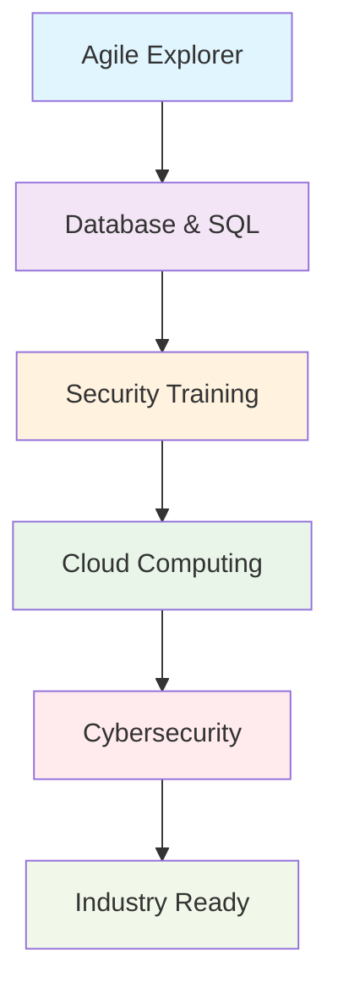

# 🏆 IBM Certifications - Holberton School France

  <h2>📜 Professional Development Journey</h2>
  
<em>Industry-recognized certifications from IBM through Holberton School France partnership</em>

  
<strong>Academic Year:</strong> 2024-2025

## 📋 Table of Contents
- [🎯 Overview](#-overview)
- [🏅 Certifications by Trimester](#-certifications-by-trimester)
- [🔗 Technologies & Skills](#-technologies--skills)
- [📈 Learning Path](#-learning-path)
- [🎓 Academic Integration](#-academic-integration)
- [🔮 Future Goals](#-future-goals)
- [👨‍💻 About](#-about)

## 🎯 Overview

This repository documents my professional certification journey through the **IBM SkillsBuild** program as part of the Holberton School France curriculum. These industry-recognized certifications complement my software engineering education with cutting-edge technologies and methodologies used in enterprise environments.

### 🤝 Partnership Program

The **Holberton School - IBM Partnership** provides students with:
- Access to IBM's enterprise-grade learning platform
- Industry-relevant curriculum aligned with market demands
- Professional certifications recognized globally
- Real-world project experience with IBM technologies
- Career pathway preparation for technology leadership roles

## 🏅 Certifications by Trimester

### 📅 Trimester 1 (September - December 2024)

#### 🚀 Agile Explorer Badge
- **Platform:** IBM SkillsBuild
- **Focus:** Agile Methodology & Project Management
- **Skills Acquired:**
  - Scrum Framework Implementation
  - Sprint Planning & Retrospectives
  - Agile Team Collaboration
  - Continuous Improvement Practices
  - User Story Development

**📁 Certificate:** [`Agile_Explorer_Badge20250119-23-lwxw9x.pdf`](certificates-trimester-1/Agile_Explorer_Badge20250119-23-lwxw9x.pdf)

---

### 📅 Trimester 2 (January - April 2025)

#### 🗄️ IBM DB0101EN - Introduction to Databases and SQL
- **Platform:** IBM SkillsBuild
- **Focus:** Database Management & SQL Programming
- **Skills Acquired:**
  - Database Design Principles
  - SQL Query Optimization
  - Data Modeling & Normalization
  - Database Security Best Practices
  - Performance Tuning

**📁 Certificate:** [`IBM DB0101EN Certificate _ IBM SkillsBuild.pdf`](certificates-trimester-2/IBM%20DB0101EN%20Certificate%20_%20IBM%20SkillsBuild.pdf)

#### 🛡️ SQL Injection Security Training
- **Platform:** IBM SkillsBuild
- **Focus:** Cybersecurity & Database Protection
- **Skills Acquired:**
  - SQL Injection Attack Vectors
  - Secure Coding Practices
  - Input Validation Techniques
  - Database Security Hardening
  - Penetration Testing Basics

**📁 Evidence:** [`sql_injection.jpg`](certificates-trimester-2/sql_injection.jpg)

---

### 📅 Trimester 3 (May - August 2025)

#### ☁️ Cloud Computing Fundamentals
- **Platform:** IBM SkillsBuild
- **Focus:** Cloud Architecture & Services
- **Skills Acquired:**
  - Cloud Service Models (IaaS, PaaS, SaaS)
  - IBM Cloud Platform
  - Container Technologies
  - Microservices Architecture
  - DevOps Integration

**📁 Certificate:** [`certificate-cloud.pdf`](certificates-trimester-3/certificate-cloud.pdf)

#### 🔒 Cybersecurity Fundamentals
- **Platform:** IBM SkillsBuild
- **Focus:** Information Security & Risk Management
- **Skills Acquired:**
  - Threat Assessment & Mitigation
  - Network Security Protocols
  - Incident Response Planning
  - Compliance Frameworks
  - Ethical Hacking Principles

**📁 Certificate:** [`certificate-cyber-1.pdf`](certificates-trimester-3/certificate-cyber-1.pdf)

## 🔗 Technologies & Skills

### 💻 Technical Competencies

| Category | Technologies | Proficiency Level |
|----------|-------------|-------------------|
| **Agile Methodologies** | Scrum, Kanban, Sprint Planning | ⭐⭐⭐⭐ |
| **Database Technologies** | SQL, Database Design, Query Optimization | ⭐⭐⭐⭐ |
| **Cloud Computing** | IBM Cloud, Container Technologies, Microservices | ⭐⭐⭐ |
| **Cybersecurity** | Security Assessment, Threat Analysis, Compliance | ⭐⭐⭐ |
| **DevOps** | CI/CD, Infrastructure as Code, Monitoring | ⭐⭐⭐ |

### 🎯 Core Skills Developed

- **Project Management** - Agile methodologies and team leadership
- **Database Administration** - SQL programming and optimization
- **Security Engineering** - Threat assessment and mitigation strategies
- **Cloud Architecture** - Scalable and resilient system design
- **Problem Solving** - Analytical thinking and solution development

## 📈 Learning Path

### 🎯 Progression Timeline

1. **Foundation Phase** - Agile methodologies and project management
2. **Data Phase** - Database design and SQL programming
3. **Security Phase** - Cybersecurity fundamentals and best practices
4. **Cloud Phase** - Cloud computing and modern architecture
5. **Integration Phase** - Combining all skills for enterprise solutions

## 🎓 Academic Integration

### 🏫 Holberton School Curriculum Alignment

These IBM certifications directly complement my Holberton School education:

- **System Administration** ↔ **Cloud Computing**
- **Database Projects** ↔ **SQL & Database Management**
- **Team Projects** ↔ **Agile Methodologies**
- **Security Projects** ↔ **Cybersecurity Training**
- **DevOps Practices** ↔ **Enterprise Integration**

### 📊 Career Preparation

| Industry Role | Relevant Certifications | Readiness Level |
|---------------|------------------------|-----------------|
| **DevOps Engineer** | Cloud + Agile | 🟢 Ready |
| **Database Administrator** | SQL + Security | 🟢 Ready |
| **Cloud Architect** | Cloud + Security | 🟡 Developing |
| **Security Analyst** | Cybersecurity + SQL | 🟡 Developing |
| **Project Manager** | Agile + All Technical | 🟢 Ready |

## 🔮 Future Goals

### 🎯 Short-term Objectives (2025)
- [ ] Complete IBM Cloud Specialist certification
- [ ] Obtain AWS Cloud Practitioner certification
- [ ] Pursue advanced cybersecurity specializations
- [ ] Apply skills in Holberton final projects

### 🚀 Long-term Vision (2025-2026)
- [ ] IBM Certified Solution Architect
- [ ] Advanced DevOps and Site Reliability certifications
- [ ] Contribute to open-source IBM projects
- [ ] Mentor junior developers in enterprise technologies

## 👨‍💻 About

**Patrick Michel** - Software Engineering Student at Holberton School France

- 🎓 **Program:** Full-Stack Software Engineering
- 🏢 **Partnership:** IBM SkillsBuild Program Participant
- 🌍 **Location:** France
- 📧 **Contact:** patrick.yann.michel@gmail.com
- 💼 **LinkedIn:** [Connect with me](https://linkedin.com/in/patrick-michel)
- 🐙 **GitHub:** [@Pmichel74](https://github.com/Pmichel74)

### 💡 Professional Philosophy

*"Combining rigorous software engineering education with industry-leading certifications to build enterprise-ready solutions that drive innovation and business value."*

---

**🎓 Holberton School France x IBM Partnership**

*Bridging education and industry through world-class technology training*

**📚 Continuous Learning • 🚀 Innovation • 💼 Industry Excellence**

